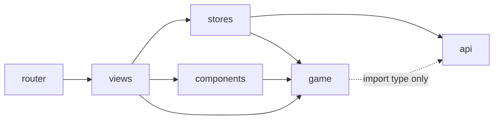

# Architecture Spine — Mugloar Game Client

## Design Paradigm

The paradigm is **layered by type**, following the create-vue default folders, plus one pure-logic layer. **YAGNI** governs: no interface, abstraction, or pattern is added until a second concrete use exists.

| Layer | Directory | Holds |
| --- | --- | --- |
| API | `src/api/` | The only `fetch` caller. Raw response types (DTOs), `ApiError`, and the base URL constant. |
| Game logic | `src/game/` | Plain TypeScript with no Vue imports: decoding, value registries, cue derivations, turn merge and deltas, save parsing, domain types. |
| State | `src/stores/` | Pinia stores. The only callers of `api/`, and the only place state is mutated. |
| Screens | `src/views/`, `src/App.vue` | Route-level screens. Read stores, call their actions, navigate. |
| Presentational | `src/components/` | Props in, emits out. No store or API access. |
| Routing | `src/router/` | Route table only. |



## Invariants & Rules

### AD-1 — Dependency direction

- **Binds:** all
- **Prevents:** components that fetch or mutate state, and logic that only works inside Vue.
- **Rule:** Imports follow the diagram above and nothing else.
  - `components/` never imports `stores/` or `api/`.
  - `game/` imports no Vue or Pinia, and only `import type` from `api/`.
  - `views/` never import `api/`.
  - `router/` imports only views.
  - Enforced by ESLint `no-restricted-imports` overrides per folder. In `game/`, only `import type` from `@/api/*` is allowed.

### AD-2 — Single API gateway [ADOPTED]

- **Binds:** CAP-1–5, CAP-11
- **Prevents:** scattered `fetch` calls with different URLs, headers, or error handling.
- **Rule:** Only `src/api/` calls `fetch`. The base URL `https://dragonsofmugloar.com/api/v2` is a constant there, not an env var. The API layer returns raw DTOs as the live API sends them (`api-contract.md`), and throws `ApiError` on any non-2xx response or network failure, never parsing the HTML error body.

### AD-3 — Only decoded data crosses into state [ADOPTED]

- **Binds:** CAP-2, CAP-3, CAP-6, CAP-9
- **Prevents:** one component decoding encrypted ads while another shows or submits the encoded `adId`.
- **Rule:** Stores pass every ad through `game/decodeAd()` before storing it. Stores and components only ever see the domain `Ad`. It carries no `encrypted` field, but has a `solvable: boolean` flag.
  - `encrypted: 1` is decoded as base64 into UTF-8 bytes via `TextDecoder`. Whether the payload is UTF-8 is [U].
  - `encrypted: 2` is decoded as ROT13.
  - An unlisted `encrypted` value keeps its raw fields, gets `solvable: false` and tier `unknown`, and warns in dev (CAP-9). It is never dropped.
  - A non-solvable ad's solve control is disabled.

### AD-4 — `game/` owns every value mapping and cue derivation

- **Binds:** CAP-4, CAP-6, CAP-9, CAP-16, CAP-17
- **Prevents:** cut-offs, ranks, mappings, or strategy rules duplicated across components and drifting from the measured data.
- **Rule:** `game/` holds the only implementations of these functions. Registries are copied from `observed-values.md`, `risk-cues.md`, and `strategies.md`.

  | Function | Returns | Notes |
  | --- | --- | --- |
  | `riskTier(probability)` | `'safe' \| 'moderate' \| 'risky' \| 'deadly' \| 'unknown'` | |
  | `itemEffect(itemId)` | effect, or none | |
  | `urgency(expiresIn)` | `'critical' \| 'soon' \| 'normal'` | |
  | `rewardRanks(ads)` | `Map<adId, 'high' \| 'mid' \| 'low'>` | Sorted by reward descending, ties broken by `adId`. The first `ceil(n/3)` are high, the next `ceil(n/3)` mid, the rest low. |
  | `affordability(gold, cost)` | `{ state: 'yes' \| 'no' \| 'unknown'; shortfall: number \| null }` | `'unknown'` when gold is `null`. |
  | `anyAffordable(gold, items)` | boolean | |

  | `riskLevel(probability)` | `1 \| 2 \| 3 \| 4 \| null` | Derived from `riskTier` (safe → 1 … deadly → 4, unknown → `null`); no second label table. |
  | `winRatePct(level)` | `100 \| 70 \| 40 \| 10` | Integer percent, so comparisons have no float ties. |
  | `expectedReward(ad)` | `number \| null` | `reward × winRatePct`, an integer (percent-scaled); `null` when the risk is unknown. |
  | `sortJobs(board, strategy)` | `Ad[]` (new array) | See *Sorting* below. Never filters. |
  | `shopHint(input)` | `{ kind: 'critical-health' \| 'increase-level'; itemId: string \| null } \| null` | See *Hints* below. |
  | `shelfOrder(items)` | `ShopItem[]` | Cost ascending, then API response order. The shop view and `shopHint` both use it. |

  **Sorting.** `sortJobs` splits the board into measured ads and unknown-risk ads. Measured ads are sorted by `strategy.sortBy` in order, then by `adId` as the final key. Unknown-risk ads always come after every measured ad (including deadly), sorted by `reward` descending, `expiresIn` ascending, then `adId`. The sort is stable and deterministic across refetches.

  **Hints.** `shopHint({ strategy, status, boardStale, stats, board, shop })` evaluates in this order and returns the first match:
  1. `null` unless `status === 'playing'`.
  2. **Critical health:** `stats.lives` is known and `≤ strategy.criticalHealth`. Returns `critical-health` with the item whose `itemEffect` grants a life (the first in `shelfOrder`), or `itemId: null` if the shop has none. It applies whether or not the item is affordable; its buy control shows the shortfall (AD-8). It never falls through to the level hint.
  3. **Increase level:** the board is fresh (`!boardStale`), has at least one measured ad, and every measured ad's `riskLevel ≥ strategy.increaseLevelAtRisk`. Candidates are level items whose `affordability` is `'yes'`. `optimizeShopFor: 'gold'` picks the cheapest; `'turns'` picks the most levels, then the cheapest. Ties go to the first in `shelfOrder`. No affordable candidate means `null`.
  4. Otherwise `null`.

  Strategies live in `game/strategies.ts`: one `Strategy` interface (`sortBy`, `criticalHealth`, `increaseLevelAtRisk`, `optimizeShopFor`) and one declarative object per strategy, keyed by `StrategyId = 'safe' | 'glory'`. Sort keys are named functions in a single registry. Components and views never branch on the strategy id; they read the store's derived values (AD-6).

  Board-relative results (`rewardRanks`) are computed once by the view and passed as props. A registry miss returns `unknown` or no effect, and calls `console.warn` naming the field and value, in dev builds only.

### AD-5 — One error shape; only `GET messages` decides expiry

- **Binds:** CAP-1–5, CAP-11
- **Prevents:** per-component error handling, and a live game being wiped because solving an ad missing from the server returned 404.
- **Rule:** `ApiError { status: number | null; kind: 'not-found' | 'network' | 'http' }`. Stores catch it and map it to state:
  - **Expired:** only a `not-found` from `GET messages` sets status `expired`. A `not-found` from solve or buy is inconclusive; the pipeline's message refetch (AD-7) decides. When the game expires with a known `score` and `turn`, the same step calls `append()` once with `expired: true` (AD-9).
  - **Anything else:** sets `error` and leaves the game state untouched. The error clears when the next action starts.
  - **Retry:** the player re-invokes an action through a visible control. Nothing retries automatically.

  Components render store state and never catch.

### AD-6 — Store ownership [ADOPTED]

- **Binds:** CAP-1–5, CAP-7, CAP-10–12, CAP-16, CAP-17
- **Prevents:** two owners of the same game data, and the shop tab, shop view, and board disagreeing about the strategy's advice.
- **Rule:** There are exactly two stores.

  **`useGameStore`** owns:
  - `gameId`
  - `status`: exactly one of `'idle' | 'loading' | 'playing' | 'over' | 'expired'`
  - `stats` (AD-11)
  - `board: Ad[]`
  - `boardStale`: true while the board could not be refreshed (AD-18)
  - `shop: ShopItem[]`
  - `reputation`: the latest value, or `null`
  - `log: TurnRecord[]` (AD-7)
  - `strategyId: StrategyId`, default `'safe'`, reset by `start()` and `load()`
  - `pending`
  - `error`
  - `expiredNotice`: a one-shot flag, cleared by `start()`

  **`useHighScoresStore`** owns the list of finished-game scores. Each entry is `{ gameId: string; score: number; turn: number; endedAt: string; expired: boolean }`, with `endedAt` in ISO 8601. The list is only appended to, and is sorted best-first when read.

  The game store also exposes two computed values, `sortedBoard` (`sortJobs`) and `hint` (`shopHint`), built from `strategyId` and its own state via `game/` (AD-4). Views read these; they never call `sortJobs` or `shopHint` themselves.

  The game store's game-over step calls `useHighScoresStore().append()`. That is the only store-to-store call. The API's `highScore` field is ignored: it was 0 in every probe game [V 2026-10-01].

### AD-7 — Mutation only through actions, one pipeline [ADOPTED]

- **Binds:** CAP-1–5, CAP-7, CAP-12, CAP-16
- **Prevents:** actions that order steps differently, erase known stats, record nothing, or apply a previous game's response.
- **Rule:** State changes only inside these actions: `start()`, `load(gameId)`, `solve(adId)`, `buy(itemId)`, `investigateReputation()`, `refreshMessages()` (a player-triggered retry), `refreshShop()` (a player-triggered retry), and `setStrategy(id)`. `setStrategy` calls no API and is not blocked by `pending` (AD-8).
  - `start()` resets the full state first. Restart from game over calls `start()` directly; there is no separate restart action.
  - Every action captures `const id = gameId` before its first `await`, and after each `await` returns without touching state if the store's `gameId` changed. The same applies to `start` and `load`, via the requested id.

  Turn actions (`solve`, `buy`, `investigateReputation`) run exactly this sequence:
  1. `pending = true`, `error = null`.
  2. Snapshot the previous stats.
  3. Call the API.
  4. `game/applyTurn(prev, response)` returns `{ stats, deltas }`. Only fields present in the response change; a missing field is unchanged, never `null`. Reputation returns no `turn`, so `turn` increments by +1 locally when known (derived from the inferred [V] in `api-contract.md`). A delta exists only where both sides are numbers.
  5. Set `stats` and append one `TurnRecord` to `log`.
  6. Run the game-over step (AD-9).
  7. If still `playing`, refetch messages (AD-18 governs failures of this refetch).
  8. In `finally`: `pending = false`.

  If the API call fails, no `TurnRecord` is appended, `error` is set, and step 7 still runs, because the board may be stale. With AD-18, a failed refetch blocks solving, so in single-tab play a stale board can only come from another tab or device playing the same game. A 404 on that refetch means `expired` (AD-5).

  A `TurnRecord` stores display text as a snapshot, never a reference. `log` is append-only, held in memory for the current game only, unbounded, and reset with the game. The record keeps every delta; the log component shows only gold and lives (CAP-12). It is defined once in `game/`:

  ```ts
  type Deltas = Partial<Record<'lives' | 'gold' | 'score' | 'level' | 'turn', number>>
  type TurnRecord = { seq: number; turn: number | null } & (
    | { kind: 'solve'; adMessage: string; success: boolean; message: string; deltas: Deltas }
    | { kind: 'buy'; itemName: string; success: boolean; deltas: Deltas }
    | { kind: 'reputation'; reputation: Reputation; deltas: Deltas }
  )
  ```

  - `seq` is a per-game counter owned by the store, reset with the game, used as the list key.
  - `turn` is the turn after the action, `null` when unknown.
  - Reputation entries have no success mark.
  - Display text (`adMessage`, `itemName`) is captured from the ad or item before the API call's `await`.
  - `setStrategy` is the only writer of `strategyId`; the switch binds `:model-value` and calls it, never `v-model` on store state. A reload resets the strategy to the default (accepted; persistence is deferred).

### AD-8 — One request at a time, and no doomed buys [ADOPTED]

- **Binds:** CAP-1, CAP-3, CAP-4, CAP-5
- **Prevents:** a double click creating two games or spending two turns, and a buy that is sure to fail but still spends a turn.
- **Rule:**
  - Turn actions (`solve`, `buy`, `investigateReputation`) and the retries (`refreshMessages`, `refreshShop`) return immediately unless `status === 'playing'`, and their controls render `disabled` otherwise.
  - While `pending` is true, every action except `load` and `setStrategy` returns immediately without calling the API, and every action control renders `disabled`. `start` sets `pending` too.
  - A buy control is disabled when gold is known and below the cost. It shows the shortfall in text, linked with `aria-describedby`.
  - Every buy with gold ≥ cost succeeded [V], and a failed buy still costs a turn [V].

### AD-9 — Game over is a client rule, recorded once

- **Binds:** CAP-7, CAP-10, CAP-11
- **Prevents:** a missed game over, the same score added twice, and a known score lost to idle expiry.
- **Rule:**
  - `lives === 0` in a solve or buy response sets status `over`. Only solve can take lives to 0, and it always returns `score` and `turn` [V], so the high-score entry's `score` is always a number.
  - The same step calls `append()` with `expired: false`. An `expired` game with known `score` and `turn` is appended with `expired: true` (AD-5); an expired game with unknown stats is not recorded. `append()` re-reads the stored list, ignores a `gameId` already present, then writes. The UI labels expired entries.
  - Stores never navigate: `GameView` watches `status` and replaces the route with `/game/:gameId/over`.

### AD-10 — The URL picks the game; `load` runs once per game [ADOPTED]

- **Binds:** CAP-1, CAP-4, CAP-7, CAP-8, CAP-11, CAP-15
- **Prevents:** the URL and the store disagreeing, and a game being reloaded or wiped on every panel switch.
- **Rule:** These are the routes. `gameId` is always a path parameter.

  | Route | Shows |
  | --- | --- |
  | `/` | Start screen, high scores, and the `expiredNotice` if set |
  | `/game/:gameId/ads` | Jobs board, `AdsPanel` (default). `/game/:gameId` redirects here. |
  | `/game/:gameId/shop` | Shop, `ShopPanel` |
  | `/game/:gameId/over` | Game over |

  `AdsPanel`, `ShopPanel`, and `GameOverView` are child-route components rendered through `GameView`'s `<RouterView>`; exactly one is shown at every width. `GameView` itself renders the stats, reputation, Risk level switch, the ads/shop navigation (with the hint highlight), and the activity log.

  `GameView` (the parent route) calls `load(route.params.gameId)` from a `watch` with `immediate` on that param. Switching panels never calls `load`. `load` behaves as follows:
  - **No-op** if the store already holds that `gameId` with status `playing` or `over`.
  - **Save found:** restore it (AD-12), then fetch messages. A 404 means `expired`.
  - **No save:** fetch messages and the shop, and leave the stats `null` (AD-11).
  - **Different `gameId`:** a `gameId` different from the store's replaces the state entirely.

  `/over` renders from the store. On entry only (not reactively), if the store doesn't hold that game as `over` (for example after a reload), it redirects to `/`; the high-score list already holds the result. "Play again" calls `start()` and navigates to the new game, which this one-time check never intercepts.

  `GameView`'s `status` watch runs `immediate`, so opening `/ads` or `/shop` for a game the store holds as `over` replaces the route with `/over`.

  On `expired`, `GameView` replaces the route with `/`, and the start screen shows `expiredNotice`.

### AD-11 — Stats can be unknown

- **Binds:** CAP-1, CAP-4, CAP-11, CAP-12
- **Prevents:** components assuming stats are always numbers when a game is opened on a second device.
- **Rule:**
  - `stats` is `{ lives, gold, level, score, turn }`, each `number | null`. `null` means unknown until a response carries the field. No endpoint reads stats [V], and only solve returns `score`.
  - Components render `null` as an explicit "unknown" state.
  - Deltas involving `null` are omitted, and affordability is `'unknown'` (AD-4).

### AD-12 — Persistence: one writer, versioned, bounded [ADOPTED]

- **Binds:** CAP-10, CAP-11
- **Prevents:** a cleared save being rewritten, a stale shape crashing the app, high scores lost by another tab or by a version bump, and saves piling up.
- **Rule:**

  **Game save**
  - Key: `mugloar:game:v<G>:<gameId>`.
  - Shape: `{ gameId, stats, shop, reputation, savedAt }`. The activity log, strategy, board, `status`, `pending`, and `error` are not persisted. A restore sets status `playing`.
  - Only a deep `watch` in the game store writes or removes it:
    - writes while `status === 'playing'`
    - removes it on `over` or `expired`
    - does nothing while `gameId` is `null`
  - Actions never touch `localStorage`.

  **High scores**
  - Key: `mugloar:highscores:v<H>`. It is written only by `append()` (AD-9), and hydrated from storage on read.

  **Both keys**
  - `<G>` and `<H>` are versioned independently. A bump only discards that key's data.
  - `game/parseSave()` and `game/parseHighScores()` are the only shape checks. On failure, the key is removed.
  - On app boot, game saves with `savedAt` older than 24 hours are removed. Games expire within about 40 minutes of idling [V bounds].

### AD-13 — API call budget [ADOPTED]

- **Binds:** CAP-2, CAP-4, CAP-5
- **Prevents:** unnecessary load on a free third-party API.
- **Rule:**
  - No polling or timers. The only automatic retry is the bounded board-refetch retry in AD-18.
  - Messages are fetched by `load`, by turn actions (AD-7 step 7), and by `refreshMessages()`.
  - The shop list is fetched once per game, by `start` or by a `load` without a save.
  - Reputation is fetched only by an explicit player action, labelled as costing a turn.

### AD-14 — Size units [ADOPTED]

- **Binds:** CAP-8, CAP-15
- **Prevents:** breakpoints written as if 1rem = 10px, and nested scroll regions fighting the page scroll. Inside media queries, rem uses the initial font size, normally 16px [V, Media Queries 4].
- **Rule:**
  - `html { font-size: 62.5% }`, and every length uses `rem`, including media queries. `px` is allowed only for hairlines (1px borders).
  - Layout is mobile-first with `min-width` queries.
  - Breakpoints are declared once, annotated with their px value at 16px (for example `48rem /* 768px */`).
  - Game screen layout, in the global layout stylesheet:
    - From 48rem up: a fixed-height grid, `height: 100dvh` (dvh: Chrome 108, Firefox 101, Safari 15.4 [V MDN compat data 2026-10-02]; Vite 8's default target is newer, so no `vh` fallback), rows `auto / minmax(0, 1fr) / var(--log-height) / auto` (top bar, routed view, log, credits line). `--log-height: 10rem`. There are exactly two scroll regions, the routed view and the log (`overflow-y: auto` each); the page never scrolls.
    - Below 48rem: the page scrolls. The top bar (stats, reputation, Risk level switch, navigation) is a direct child of the game `<main>` with `position: sticky; top: 0`. The bottom bar (log plus the credits line) is its last child with `position: sticky; bottom: 0`; the log has height `var(--log-height-mobile)` (`5rem`) and its own scroll. The tokens keep the two bars under half the viewport at 360 × 640 px.
    - Sticky preconditions: no ancestor of the sticky bars sets `overflow` to `hidden`, `auto`, or `scroll` (use `overflow-x: clip` for CAP-8); both bars are direct children of the page-tall game container; `html` sets `scroll-padding-block` to the bar heights so focused controls are never hidden under them (WCAG 2.2 SC 2.4.11, technique C43).
  - Only the global layout stylesheet contains viewport-size `@media` queries. User-preference queries (`prefers-reduced-motion`) may appear in components (AD-15). Components adapt with intrinsic layout (`flex-wrap`, grid `auto-fit` with `minmax`) or `@container` queries, never their own `@media`.

### AD-15 — Accessibility is part of done [ADOPTED]

- **Binds:** all UI
- **Prevents:** inaccessible patterns that are expensive to retrofit.
- **Rule:** The target is WCAG 2.2 AA: 4.5:1 contrast for text, 3:1 for non-text cues such as tier colours.

  **Semantics**
  - Native semantic elements only: actions are `<button>`, collections are `<ul>/<li>`, and each screen has `<main>`. No clickable non-interactive elements.
  - Each screen has one `<h1>`. In the game, each panel (ads, shop) owns the `<h1>`.

  **Interaction**
  - Every action is keyboard-operable with a visible focus style.
  - Mechanism: router `afterEach` + `nextTick`, skipped on first load; route components imported eagerly.
  - `GameView` owns focus: on every route change after the first render, and after a turn when the focused control was disabled or removed, it focuses the active panel's `<h1>` (`tabindex="-1"`). Whether browsers drop focus on a disabled button is [U]; the rule covers both outcomes.

  **Conveying information**
  - Risk tier, urgency, affordability, and unknown stats are conveyed in text (visually hidden where needed), never by colour or icon alone.
  - Icon-only controls carry `aria-label`. Decorative icons carry `aria-hidden="true"`.

  **Live region and motion**
  - `GameView` always renders the activity log as a `<section role="log" aria-live="polite" aria-labelledby>` wrapping a plain `<ol>` (`role="log"` is not allowed on `ol`/`ul` [V ARIA in HTML]; its implicit politeness is [V WAI-ARIA 1.2], screen-reader support without explicit `aria-live` is [U], hence the explicit attribute). It is the only live region for turn results. Only its entries change; the log is never added with `v-if`. On a new entry it sets its own `scrollTop` to the end instantly (never `scrollIntoView`, never smooth scrolling).
  - The Risk level switch is a radio group (native radios styled as a button group), so arrow keys change it.
  - Animations, such as the urgency pulse, are inside `@media (prefers-reduced-motion: no-preference)`.

### AD-16 — Tests never hit the live API [ADOPTED]

- **Binds:** all tests
- **Prevents:** a test suite that bills or rate-limits the provider, or flakes on its state.
- **Rule:** `src/test-setup.ts` is registered in `vitest.config.ts` `test.setupFiles`, with `unstubGlobals: true`. Before each test it stubs `fetch` to throw `Unstubbed fetch in test`. Tests override the stub per case.

### AD-17 — API text is untrusted

- **Binds:** CAP-2, CAP-3, CAP-12
- **Prevents:** XSS through third-party ad text, including decoded text.
- **Rule:** Strings from the API are rendered only through text interpolation. `v-html` is forbidden, enforced by ESLint `vue/no-v-html` at error level.

### AD-18 — A stale board blocks solving [ADOPTED]

- **Binds:** CAP-2, CAP-3, CAP-12, CAP-13
- **Prevents:** a player solving ads that may no longer exist, and a failed refetch going unnoticed.
- **Rule:**
  - When `GET messages` fails with a network error, 5xx, or 429, the store retries it automatically at most twice, after 2 s and then 5 s. A 404 is never retried; it means `expired` (AD-5).
  - From the first failure until a refetch succeeds, `boardStale` is true. Every solve control is disabled. The shop stays usable.
  - When the retries are exhausted, the board shows a themed notice from `src/copy.ts` with a button that calls `refreshMessages()`. The button's label states the plain action, for example "Check the board again".
  - The retry counts as part of the action that triggered it, so `pending` stays true until the retries finish.

## Consistency Conventions

| Concern | Convention |
| --- | --- |
| File names | Components and views are `PascalCase.vue`. Everything else is `kebab-case.ts`, as allowed by oxlint `unicorn/filename-case`. |
| Stores | `src/stores/<name>.ts` exports `use<Name>Store`, written in setup-store style. |
| Tests | `*.spec.ts` in a `__tests__/` folder next to the code under test. Component tests query by role and accessible name. |
| Types | DTOs end in `Dto` (`AdDto`) and live in `api/`. Domain types (`Ad`, `ShopItem`, `Stats`, `Reputation`, `TurnRecord`, `Deltas`, `Strategy`, `StrategyId`) live in `game/`. |
| API field names | Domain types keep the API's camelCase names (`adId`, `expiresIn`). No renaming layer. |
| Design tokens | All colours, spacing, font sizes, and tier colours are CSS custom properties in one global tokens stylesheet. Components use the tokens, never literal values. |
| Styles | `<style scoped>` per SFC. No CSS framework. |
| Icons | UI glyphs come from `@lucide/vue`, imported per icon. Themed art is game-icons.net SVG files in `src/assets/icons/` (approved set: Lorc, Delapouite, Sbed). A one-line credits line naming **each icon's author**, the site, and CC BY 3.0 is visible on every screen: inside the game grid on the game screen (AD-14), as the footer elsewhere. |
| Activity log entries | Only the newest entry shows its flavour subheading; older entries are one line. |
| Fonts | Self-hosted, never a Google Fonts link. Fredoka for headings and numbers, Nunito for body text. |
| Shop entry signals | The navigation's shop link shows at most one hint: `critical-health` ("Low health") over `increase-level`. Affordability (CAP-6) is a separate, lower-emphasis marker. |
| Hint copy | Level hints are keyed by item id in `src/copy.ts` (one line per level item, plus a fallback), so the shown line is deterministic. Wording never promises a better win rate (premise [U]). |
| Player-facing text | Every error, notice, and empty state uses in-world tavern voice, for example *"The barman went to put up new posters. Come back later, or have a beer."* All of it lives in one module, `src/copy.ts`; no inline user-facing strings. Each message still says what happened, and button labels state the plain action. |
| Fact tags | Comments or docs stating API behaviour carry `[V]` (with date), `[D]`, or `[U]`, as the spec does. Write "in every probe", never "always". |

## Stack

| Name | Version |
| --- | --- |
| Node | ^22.18.0 or >=24.12.0 |
| pnpm | not pinned (user decision; whichever version is installed, 12.6.0 locally) |
| TypeScript | ~6.0 (vue-tsc doesn't support TS 7 yet) |
| Vue | ^3.5.42 |
| Pinia | ^4.0.3 |
| @vue/devtools-api | ^8.2.1 (required peer of Pinia 4) |
| vue-router | ^5.3.1 |
| Vite | ^8.2.2 |
| Vitest | ^4.1.11 (with jsdom, @vue/test-utils ^2.5) |
| oxlint + ESLint | ~1.82 / ^10.10 |
| @lucide/vue | ^1.49.0 (to add) |
| @fontsource-variable/fredoka | ^5.3.0 (to add) |
| @fontsource-variable/nunito | ^5.3.0 (to add) |

## Structural Seed

To set up during the first build: ESLint `no-restricted-imports` overrides (AD-1) and `vue/no-v-html` (AD-17) in `eslint.config.ts`, the `test-setup.ts` registration in `vitest.config.ts` (AD-16), and the "to add" dependencies in the Stack table.

```text
src/
  App.vue       # becomes a <RouterView> shell; the template's App.spec.ts is rewritten
  api/          # client.ts (fetch, ApiError, base URL), types.ts (DTOs)
  game/         # decode, registries, cues, strategies, apply-turn, parse-save, domain types
  stores/       # game.ts, high-scores.ts
  views/        # StartView, GameView (top bar, nav, log, RouterView), AdsPanel, ShopPanel, GameOverView
  components/   # StatsBar, AdCard, ShopItem, ActivityLog, RiskLevelSwitch, ReputationPanel, …
  assets/
    icons/      # game-icons.net SVGs
  styles/       # tokens, breakpoints, base (62.5% root, font imports)
  router/       # routes per AD-10
  copy.ts       # all player-facing text (tavern voice)
  test-setup.ts # AD-16 fetch guard
```



```mermaid
stateDiagram-v2
  [*] --> idle: "/"
  idle --> loading: start
  [*] --> loading: "/game/:id/*" (new id)
  loading --> playing: started, save restored + messages, or board + shop fetched
  loading --> expired: GET messages 404
  playing --> playing: solve / buy / reputation / refreshMessages (one at a time); setStrategy any time
  playing --> over: lives === 0
  playing --> expired: GET messages 404
  over --> loading: play again (start)
  expired --> idle: route "/" with notice
```

## Deployment

The app runs locally only: `pnpm dev` or `pnpm preview`, or a Docker container.
- **SPA fallback:** any server serving the build must answer unknown paths with `index.html`, so that `/game/:gameId/*` links and reloads work. `vite preview` does this by default [V, Vite 8 source].
- **Browser targets:** the Vite default build target is accepted. Whether it covers every browser and version in CAP-8 is [U].
- **CAP-8 checks:** layout is verified manually before each release, at 360 and 1440 px in the CAP-8 browsers. jsdom can't check layout.
- **Configuration:** there is no other environment and no runtime configuration.

## Capability → Architecture Map

| Capability | Lives in | Governed by |
| --- | --- | --- |
| CAP-1 Start | `stores/game` `start`, StartView | AD-2, AD-7, AD-8, AD-10 |
| CAP-2 Board | `stores/game`, `/game/:id/ads`, AdCard | AD-3, AD-7, AD-13, AD-17, AD-18 |
| CAP-3 Solve | `stores/game` `solve` | AD-3, AD-5, AD-7, AD-8, AD-18 |
| CAP-4 Shop | `stores/game` `buy`, `/game/:id/shop`, ShopItem | AD-4, AD-7, AD-8, AD-13 |
| CAP-5 Reputation | `stores/game` `investigateReputation`, ReputationPanel | AD-7, AD-8, AD-13 |
| CAP-6 Risk cues | `game/` cues, AdCard, ShopItem | AD-4, AD-15 |
| CAP-7 Game over | `stores/game`, GameView, GameOverView | AD-7, AD-9, AD-10 |
| CAP-8 Responsive | `styles/`, all views | AD-14, AD-15, Deployment |
| CAP-9 Unknown values | `game/` decode and registries | AD-3, AD-4 |
| CAP-10 High scores | `stores/high-scores`, StartView, GameOverView | AD-6, AD-9, AD-12 |
| CAP-11 Resume | `stores/game` `load`, GameView | AD-5, AD-10, AD-11, AD-12 |
| CAP-12 Activity log | `game/` apply-turn, `stores/game` `log`, ActivityLog | AD-7, AD-11, AD-15, AD-17 |
| CAP-13 Board refresh failure | `stores/game` refetch, board notice, `copy.ts` | AD-18, AD-13, AD-5 |
| CAP-14 Continue on another device | `stores/game` `load`, GameView | AD-10, AD-11, AD-5 |
| CAP-15 Layout | `styles/layout.css`, GameView | AD-10, AD-14, AD-15 |
| CAP-16 Risk level | `game/strategies`, `stores/game` `strategyId` `sortedBoard` `setStrategy`, RiskLevelSwitch, AdsPanel | AD-4, AD-6, AD-7, AD-15 |
| CAP-17 Strategy hints | `game/strategies` `shopHint`, `stores/game` `hint`, GameView nav, ShopPanel, `copy.ts` | AD-4, AD-6 |

## Open Questions

- **Base64 payload encoding.** Is it UTF-8? [U] This is decided when a non-ASCII encrypted ad is seen.
- **Solving an ad no longer on the server** (stale board). The response is [U]. AD-5 handles any outcome.

## Deferred

- **End-to-end tests.** Unit and component tests cover the rules, and CAP-8 is checked manually. Revisit when a browser-level regression shows up.
- **Docker image details** (base image, which server). They are bound only by the SPA-fallback rule.
- **TypeScript 7.** It waits until vue-tsc supports it (expected with 7.1 or later).
- **Vitest 5.** A deliberate later upgrade. Note that it changes the `clearMocks` default.
- **Environment-based configuration.** Add it when a second API target exists, such as a mock server or the recommendations backend.
- **Recommendations backend integration.** Client-side strategies (AD-4) are in scope; a backend is a non-goal and needs its own spec. If it arrives, strategy state may move to its own store.
- **Two tabs on the same game.** Unsupported: the last save wins, and the other tab hits 404 and `expired`. Different games in different tabs work. High scores merge on append (AD-9).
- **Dark mode or theming, and i18n.** Not required. The tokens stylesheet keeps theming cheap later, and the UI copy is English only.
- **CI pipeline.** Local-only project. Revisit if the repo gains collaborators.

## Sources

- npm registry via `npm view`, 2026-10-01: versions, deprecations (`lucide-vue-next` → `@lucide/vue`), peers (Pinia 4 → `@vue/devtools-api`)
- Media Queries 4, units: https://www.w3.org/TR/mediaqueries-4/#units
- Vitest `vi.stubGlobal`: https://vitest.dev/api/vi.html#vi-stubglobal
- Vitest 5 release: https://vitest.dev/blog/vitest-5.html
- Pinia setup stores: https://pinia.vuejs.org/core-concepts/#Setup-Stores
- Pinia releases (v4 peer change): https://github.com/vuejs/pinia/releases
- Vite CLI (preview): https://vite.dev/guide/cli
- game-icons.net licence: https://game-icons.net/about.html
- TypeScript 7 / vue-tsc: https://visualstudiomagazine.com/articles/2026/06/22/typescript-7-0-rc-moves-microsofts-go-rewrite-into-the-mainline-compiler.aspx
- Feature-Sliced Design (rejected): https://feature-sliced.design/docs/get-started/overview
- MDN browser-compat-data, `css/types/length.json`, 2026-10-02: dynamic viewport units
- WAI-ARIA 1.2 `log` role: https://www.w3.org/TR/wai-aria-1.2/#log
- ARIA in HTML (allowed roles on `ol`/`ul`): https://www.w3.org/TR/html-aria/
- WAI-ARIA APG radio group pattern: https://www.w3.org/WAI/ARIA/apg/patterns/radio/
- MDN `position: sticky`: https://developer.mozilla.org/en-US/docs/Web/CSS/position
- WCAG 2.2 SC 2.4.11 and technique C43: https://www.w3.org/WAI/WCAG22/Understanding/focus-not-obscured-minimum
- Vue Router nested routes and navigation guards: https://router.vuejs.org/guide/essentials/nested-routes.html, https://router.vuejs.org/guide/advanced/navigation-guards.html
- Reviews: `reviews/review-adversary-2.md`, `reviews/review-versions-2.md`, `reviews/review-rubric.md`, `reviews/review-adversary.md`, `reviews/review-versions.md`
