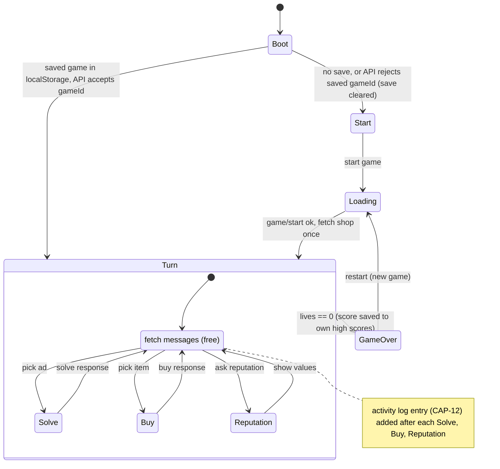

# Game flow

- If a board refresh fails, it's retried at most twice, solving is blocked while the board is stale, and then a tavern-voice notice with a retry button is shown (CAP-13).
- Board loads the messages on entry and after every action that consumes a turn. The shop list is fetched once per game; it didn't change within a game up to level 23 [V]. There is no polling.
- Reputation (CAP-5) is fetched only when the player asks, because it costs a turn.
- Store state is mirrored to `localStorage` after every change (CAP-11). Game over clears the saved game but keeps the high scores.

- The architecture companion (AD-10) has the full route map: `/`, `/game/:gameId/ads`, `/game/:gameId/shop`, `/game/:gameId/over`.
